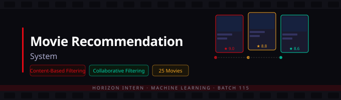
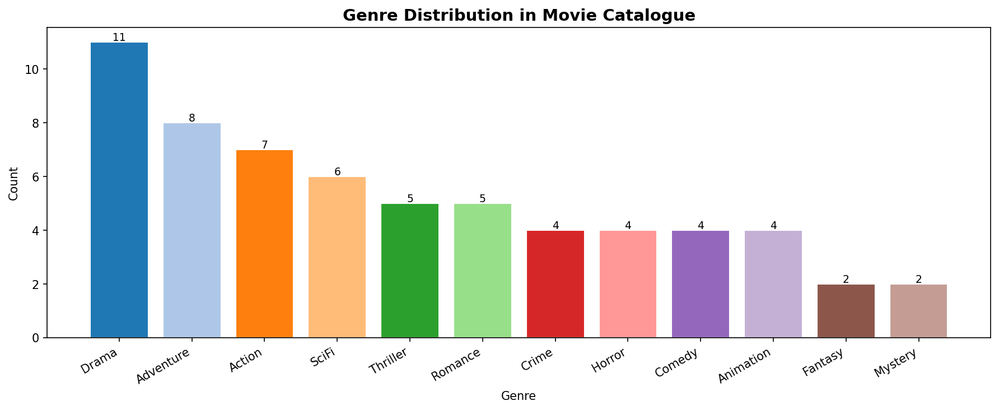
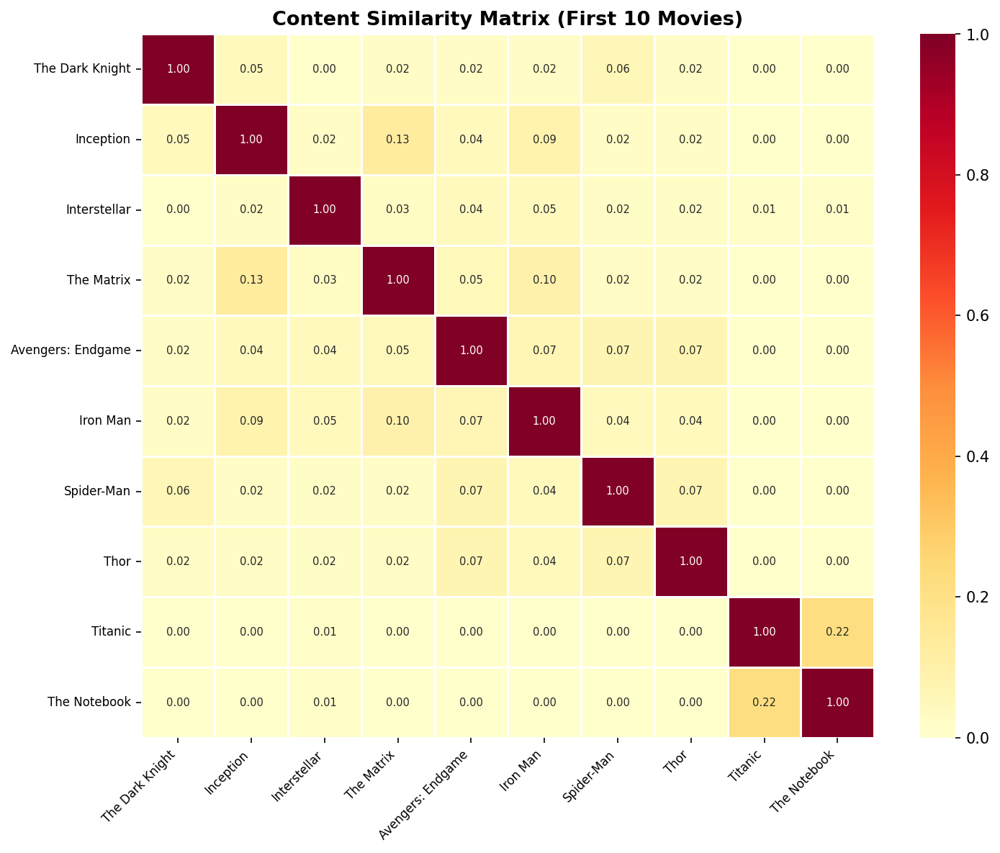
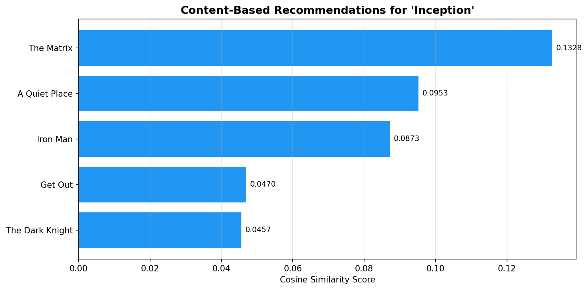
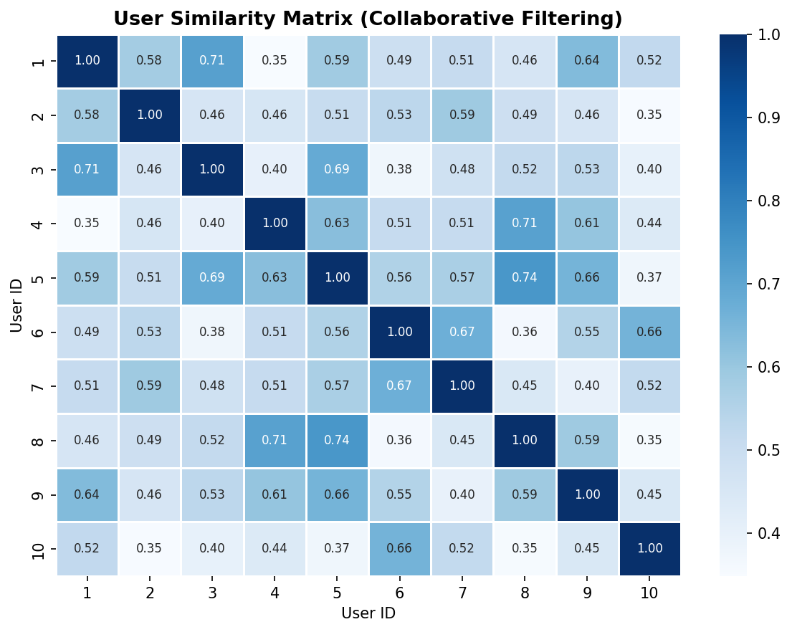

# Movie Recommendation System

<div align="center">




**A dual-algorithm Movie Recommendation System built with Content-Based Filtering and Collaborative Filtering — recommending movies from a catalogue of 25 titles across 129 user ratings using TF-IDF vectorization and cosine similarity.**

</div>

---

## Table of Contents
- [What This Project Does](#what-this-project-does)
- [Two Algorithms, One System](#two-algorithms-one-system)
- [Dataset](#dataset)
- [How It Works](#how-it-works)
- [Live Recommendations](#live-recommendations)
- [Screenshots](#screenshots)
- [Tech Stack](#tech-stack)
- [How to Run](#how-to-run)
- [Key Insights](#key-insights)
- [Author](#author)

---

## What This Project Does

Most streaming platforms today use recommendation engines to keep users engaged. This project builds one from scratch — implementing **two different recommendation strategies** and comparing their outputs:

- **Content-Based Filtering** — "If you liked *Inception*, here's what's similar based on genre and description"
- **Collaborative Filtering** — "Users who rated movies similarly to you also loved these"

> No external dataset needed. The system generates a realistic movie catalogue and user rating matrix from scratch.

---

## Two Algorithms, One System

```
┌─────────────────────────────────────────────────────────┐
│                  RECOMMENDATION ENGINE                   │
├──────────────────────────┬──────────────────────────────┤
│   CONTENT-BASED          │   COLLABORATIVE              │
│                          │                              │
│  Movie Genres +          │  User × Movie                │
│  Descriptions            │  Rating Matrix               │
│       ↓                  │       ↓                      │
│  TF-IDF Vectorizer       │  Cosine Similarity           │
│       ↓                  │  Between Users               │
│  Cosine Similarity       │       ↓                      │
│  Between Movies          │  Find Similar Users          │
│       ↓                  │       ↓                      │
│  Top-N Similar Movies    │  Recommend Unrated Movies    │
└──────────────────────────┴──────────────────────────────┘
```

---

## Dataset

### Movie Catalogue — 25 Films across 5 Genres

| Genre | Movies |
|-------|--------|
| Action / SciFi | The Dark Knight, Inception, Interstellar, The Matrix, Avengers |
| Romance / Drama | Titanic, The Notebook, La La Land, Pride & Prejudice |
| Classic Drama | The Shawshank Redemption, Forrest Gump, Schindler's List, The Godfather |
| Animation | Toy Story, Finding Nemo, The Lion King, Shrek |
| Horror / Thriller | Get Out, A Quiet Place, The Conjuring, It, Parasite |

### User Ratings

| Stat | Value |
|------|-------|
| Total Users | 10 |
| Total Ratings | 129 |
| Ratings per User | 8–17 movies |
| Rating Scale | 1.0 — 10.0 |

---

## How It Works

### Content-Based Filtering
```
Each movie → Genre + Description text
                    ↓
           TF-IDF Vectorization
           (ngram_range = 1–2)
                    ↓
        25 × 25 Cosine Similarity Matrix
                    ↓
     Pick a movie → find top-N most similar
```

### Collaborative Filtering
```
User ratings → 10 × 25 User-Item Matrix
                    ↓
         Cosine Similarity between users
                    ↓
         Find top-3 most similar users
                    ↓
    Weighted score for unrated movies
                    ↓
         Top-N recommendations
```

---

## Live Recommendations

### Content-Based — Because you watched *Inception*:

| Rank | Movie | Genre | Similarity |
|------|-------|-------|------------|
| 1 | The Matrix | Action SciFi | 0.1328 |
| 2 | A Quiet Place | Horror SciFi Thriller | 0.0953 |
| 3 | Iron Man | Action SciFi Adventure | 0.0873 |
| 4 | Get Out | Horror Thriller Mystery | 0.0470 |
| 5 | The Dark Knight | Action Thriller Crime | 0.0457 |

### Collaborative Filtering — Recommended for User 1:

| Rank | Movie | Rating | Score |
|------|-------|--------|-------|
| 1 | Avengers: Endgame | 8.4 | 16.82 |
| 2 | La La Land | 8.0 | 13.54 |
| 3 | Spider-Man | 7.4 | 10.69 |
| 4 | A Quiet Place | 7.5 | 9.27 |
| 5 | The Lion King | 8.5 | 9.23 |

---

## Screenshots

### 1. Genre Distribution in Movie Catalogue


### 2. Content Similarity Matrix — First 10 Movies


### 3. Content-Based Recommendations for 'Inception'


### 4. User Similarity Matrix — Collaborative Filtering


---

## Tech Stack

| Library | Version | Purpose |
|---------|---------|---------|
| Python | 3.12 | Core language |
| NumPy | 2.0.2 | Matrix operations |
| Pandas | 2.2.2 | Data manipulation |
| Scikit-learn | 1.6.1 | TF-IDF, cosine similarity |
| Matplotlib | 3.10 | Visualization |
| Seaborn | 0.13.2 | Heatmaps |

---

## How to Run

**Option 1 — Google Colab (Recommended)**

Open the notebook directly in Colab and run all cells.

**Option 2 — Local**

```bash
git clone https://github.com/venkatasriharika-code/movie_recommendation_system.git
cd movie-recommendation-system

pip install numpy pandas scikit-learn matplotlib seaborn

python movie_recommendation_system.py
```

---

## Key Insights

- **Drama is the most common genre** in the catalogue (11 tags), followed by Adventure (8) and Action (7)
- **Inception and The Matrix** have the highest content similarity (0.13) — both are mind-bending SciFi thrillers
- **Titanic and The Notebook** share 0.22 similarity — highest among any pair — both are emotional romance dramas
- **User 1 and User 3** are the most similar users (0.71 cosine similarity) — their collaborative recommendations heavily overlap
- Content-Based filtering is **genre-aware** — it correctly avoids recommending horror movies to an action/scifi fan
- Collaborative filtering surfaces **hidden gems** — La La Land recommended to a user who hasn't rated it yet, based on similar users' tastes

---

## Project Structure

```
movie-recommendation-system/
│
├── movie_recommendation_system.py      # Main recommendation engine
├── movie_recommendation_system.ipynb   # Google Colab notebook
├── screenshot1_genre_distribution.png  # Genre bar chart
├── screenshot2_content_similarity.png  # Content similarity heatmap
├── screenshot3_content_recommendations.png  # CB recommendations
├── screenshot4_user_similarity.png     # User similarity matrix
├── movie_recommendation_banner.svg     # Project banner
└── README.md                           # Project documentation
```

---

## Author

<div align="center">

**Venkata Sriharika Prathipati**

Machine Learning Intern — Horizon Intern | Batch 115

[](https://github.com/venkatasriharika-code)
[](https://linkedin.com/in/venkata-sriharika-prathipati-b9491b300)

</div>

---

*Built as part of the Horizon Intern Virtual Internship Program — Machine Learning Domain, Batch 115*
